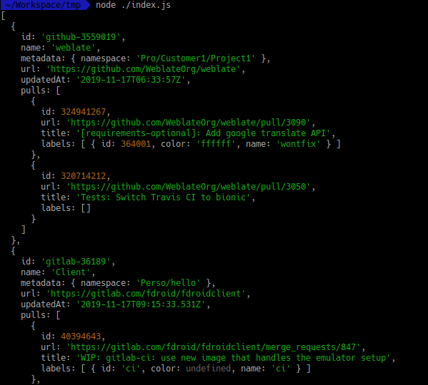

# Pull Request Aggregator

[](https://badge.fury.io/js/pull-request-aggregator)

The goal of this library is to aggregate pull-requests from different
projects, that can be on different websites (Gitlab, Github, self-hosted
Gitlab, BitBucket...) in order to build dashboards, CLI-tool, IOT project,
or whatever you want.

```javascript
import pullRequestAggregator from 'pull-request-aggregator';

const config = {
    repositories: [
        {
            // Relative path to your repository.
            path: 'WeblateOrg/weblate',
            provider: {
                // The provider.
                name:'github'

                // More options related to the provider (auth, config...)
            },
            metadata: {
                // You'll get those back in the response, so put everything
                // you need to build your screens.
                namespace: 'Pro/Customer1/Project1',
            },
        },
        {
            path: 'fdroid/fdroidclient',
            provider: {
                name:'gitlab'
            },
            metadata: {
                namespace: 'Perso/hello',
            },
        },
    ],
};

pullRequestAggregator(config)
    .then(console.log)
    .catch(console.error);
```

returns:


